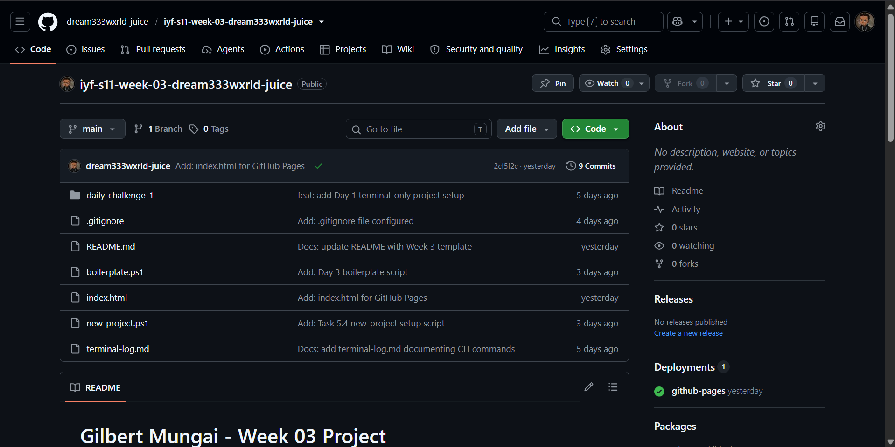

# Gilbert Mungai - Week 03 Project

Mastering the command line and Git version control — essential tools for every professional developer. This week I practiced terminal navigation, file operations, Git workflow, branching, merging, and professional documentation.

## Live Demo
[View Live Site](https://dream333wxrld-juice.github.io/iyf-s11-week-03-dream333wxrld-juice)

## Screenshot

## Features
- Terminal-only project setup
- File operations via CLI
- Git branching and merging
- .gitignore configuration
- Professional README documentation
- Boilerplate script for HTML projects

## Technologies Used
- Git & GitHub
- Bash / Terminal
- HTML5
- CSS3
- Markdown

## Project Structure
iyf-s11-week-03-dream333wxrld-juice/
├── daily-challenge-1/sss
│   ├── src/
│   │   ├── index.html
│   │   ├── css/style.css
│   │   └── js/app.js
│   └── README.md
├── boilerplate.ps1
├── new-project.ps1
├── terminal-log.md
├── .gitignore
└── README.md
## What I Learned
Learned how to navigate the file system using only terminal commands, create project structures without a GUI, and manage code history using Git. Also learned how to write meaningful commit messages and work with branches.

## Future Improvements
- [ ] Add JavaScript interactivity
- [ ] Implement dark mode
- [ ] Add project filtering

## Contact
- Email: dream333wxrld@gmail.com
- GitHub: [@dream333wxrld-juice](https://github.com/dream333wxrld-juice)

## License
This project is open source and available under the [MIT License](LICENSE).